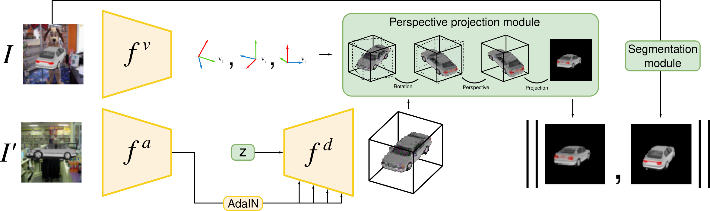
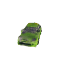
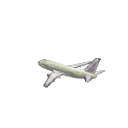

# ViewNet [[PDF](https://openaccess.thecvf.com/content/ICCV2021/papers/Mariotti_ViewNet_Unsupervised_Viewpoint_Estimation_From_Conditional_Generation_ICCV_2021_paper.pdf)]

## Unsupervised Viewpoint Estimation From Conditional Generation

(check out our NeRF extension of this work [here](https://github.com/omariott/viewnerf))

<p align="center"></p>

### Installation

```
conda env create -f spec.yml
```

### Training

Specify the dataset and log path in `config/conf_file.yaml` then run:

```python
python train.py --conf config/conf_file.yaml
```

### Visualizations

<p align="center"></p>

These visualizations were produced with higher resolution for illustration purposes.

### Citation

If you use this this code for your research, please cite our paper using:

```
@inproceedings{mariotti2021viewnet,
  title={ViewNet: unsupervised viewpoint estimation from conditional generation},
  author={Mariotti, Octave and Mac Aodha, Oisin and Bilen, Hakan},
  booktitle={Proceedings of the IEEE/CVF International Conference on Computer Vision},
  pages={10418--10428},
  year={2021}
}
```
